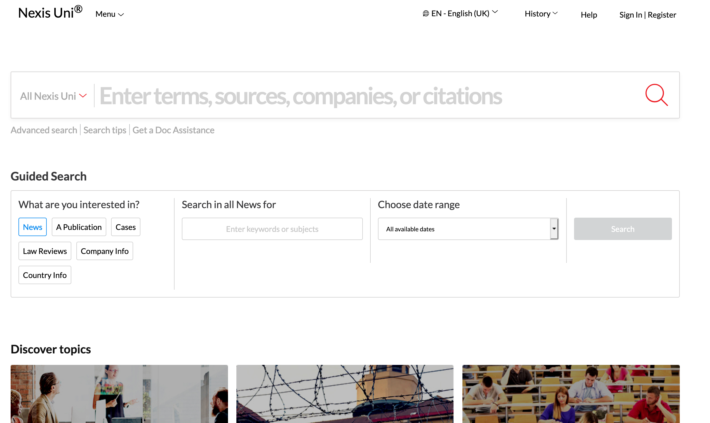
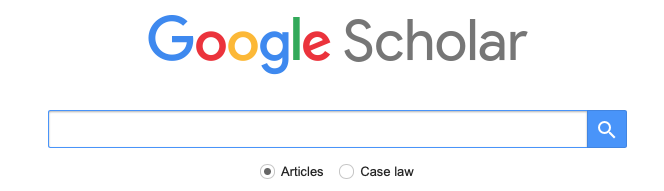
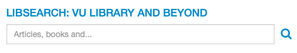
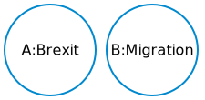
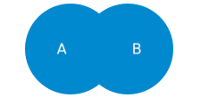
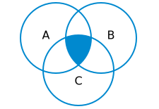

```{r setup, include=FALSE}
options(htmltools.dir.version = FALSE)
knitr::opts_chunk$set(fig.retina = 3)
```

```{r xaringan-themer, include=FALSE, warning=TRUE}
library(xaringanthemer)
style_mono_accent(
  base_color = "#0089CF",
  base_font_size = "24px",
  header_h1_font_size = "2.5rem",
  header_h2_font_size = "2rem",
  header_h3_font_size = "1.5rem",
  title_slide_background_image = "img/lost-at-sea.png",
  title_slide_background_size = "cover",
  title_slide_background_position = "right",
  text_bold_color = "var(--text-color)",
  extra_css = list(
  ".title-slide h1, h2, h3" = list(
    "text-align" = "left",
    "vertical-align" = "top",
    "text-transform" = "capitalize"
  ),
  ".title-slide h1" = list(
  "margin-top" = "-110px"
  ),
  ".remark-slide-number" = list(
  "display" = "none"
  ),
  ".card.list" = list(
    "position" = "relative",
    "left" = "20%",
    "box-shadow" = "0 4px 8px 1px rgba(0,0,0,0.05)",
    "border-radius" = "4px",
    "width" = "65%",
    "margin-bottom" = "15px"
  ),
  ".card.switch" = list(
    "position" = "relative",
    "box-shadow" = "0 4px 8px 1px rgba(0,0,0,0.05)",
    "border-radius" = "4px",
    "width" = "65%",
    "float" = "left",
    "margin-bottom" = "15px"
  ),
  ".card.small" = list(
    "position" = "absolute",
    "border-radius" = "4px",
    "margin" = "15px",
    "padding" = "5px",
    "background-color" = "rgba(0, 137, 207, 0.1)"
  ),
  ".card.highlight" = list(
    "background-color" = "rgba(136, 63, 160, 0.1)"
  ),
  ".card h2" = list(
    "color" = "white",
    "background-color" = "rgba(0, 137, 207, 0.4)",
    "font-size" = "1.1rem",
    "padding" = "5px",
    "margin-top" = "0",
    "margin-bottom" = "4px",
    "border-radius" = "4px 4px 0 0"
  ),
  ".card.switch ul, div.card ol" = list(
  "margin-bottom" = "4px",
  "padding-bottom" = "15px"
  ),
  ".card p" = list(
  "margin" = "10px"
  ),
  ".card.switch.right" = list(
  "float" = "right",
  "text-align" = "left"
  )
  # "div.card-switch ~ div.card1" = list(
  # "margin-top" = "0"
  # )
)
)
```
class:inverse
<!-- # Before we start -->
<!-- <audio controls> -->
<!--   <source src="audio/test.ogg" type="audio/ogg"> -->
<!--   <source src="audio/test.mp3" type="audio/mpeg"> -->
<!-- Your browser does not support the audio element. -->
<!-- </audio> -->
<!-- --- -->


# Why do you need information?
---

# Why do you need information?
<div class="card switch">
<h2>Context</h2>
<p>How does this work fit into other discussions?</p>
<p>What arguments were made previously?</p>
</div>

<div class="card switch right">
<h2>Motivation</h2>
<p>Why is this work important / interesting?</p>
</div>

<div class="card switch">
<h2>Novelty</h2>
<p>You can only argue that your work adds something new if you first show what has been done before.</p>
</div>

---
class:inverse

# Where can you find information?

---

# Where can you find information?
<span class="card small" style="top:48%;left:27%">Personal blogs, vlogs, etc</span>
<span class="card small" style="top:35%;left:74%">Company websites</span>
<span class="card small" style="top:26%;left:69%">(Inter)national organisations</span>
<span class="card small" style="top:30%;left:11%">Newspapers & magazines</span>
<span class="card small" style="top:60%;left:62%">Your friends after a night<br>on the town</span>
<span class="card small" style="top:40%;left:58%">Wikipedia</span>
<span class="card small" style="top:80%;left:22%">Political parties</span>
<span class="card small" style="top:61%;left:26%">Social media</span>
<span class="card small" style="top:29%;left:53%">Documentaries</span>
<span class="card small" style="top:72%;left:51%">Academic studies</span>
---

# Aspects of information

<div class="card list" style="margin-top:100px;margin-bottom:50px;">
    <h2>Time versus trust</h2>
    <p>How difficult is it to check the information?</p>
    <p>How much time does it take?</p>
</div>

<div class="card list">
    <h2>Objectives</h2>
    <p>Why was the information provided?<br>Persuasion or information?</p>
</div>

---

# Where can you find information?

<div class="card list" style="position:relative;top:10%;">
    <h2>Search broadly</h2>
    <p>No need to limit yourself to academic studies</p>
    <p>Different sources can answer different kinds of questions</p>
    <p>Be aware of your information source and its limits.</p>
</div>

---

# Where can you find information?

<div class="card switch">
    <h2>Interesting topics & relevant discussions</h2>
    <p>
        Social media (Twitter)</br>
        Newspapers & magazines
    </p>
</div>

<div class="card switch right">
    <h2>Opinions & points of view</h2>
    <p>NGOs, political organizations, companies</p>
</div>

<div class="card switch">
    <h2>Background info</h2>
    <p>Wikipedia</br>
        Textbooks, handbooks</p>
</div>

<div class="card switch right">
    <h2>Detailed analysis, &ldquo;proof&rdquo;</h2>
    <p>Academic books/articles</p>
</div>
---

class:inverse

# Finding information<br>from different sources

---

# Finding information<br>from different sources
<span class="card small" style="top:48%;left:27%">Personal blogs, vlogs, etc</span>
<span class="card small" style="top:35%;left:74%">Company websites</span>
<span class="card small" style="top:26%;left:69%">(Inter)national organisations</span>
<span class="card small highlight" style="top:30%;left:11%">Newspapers & magazines</span>
<span class="card small" style="top:60%;left:62%">Your friends after a night<br>on the town</span>
<span class="card small" style="top:40%;left:58%">Wikipedia</span>
<span class="card small" style="top:80%;left:22%">Political parties</span>
<span class="card small" style="top:61%;left:26%">Social media</span>
<span class="card small" style="top:29%;left:53%">Documentaries</span>
<span class="card small highlight" style="top:72%;left:51%">Academic studies</span>

---
layout: false

# Access to information

<div class="card list" style="margin-top:80px;margin-bottom:50px;">
    <h2>On campus</h2>
    <p>
        Should have access automatically<br>
        If not: Log on to VUnet<br>
        But: <i>no one is on campus...</i>
    </p>
</div>

<div class="card list">
    <h2>Off campus</h2>
    <p>
        Log on to VUnet<br>
        Search materials using <a href="#libsearch">Libsearch</a><br>
        See <a href="https://ub.vu.nl/en/search-help/off-campus-access/index.aspx" target=_blank>this information</a>.
    </p>
</div>

---
name: template-nexis

# Finding information in<br>magazines & newspapers

<div class="card list">
    <h2>Options</h2>
    <p>Browse the paper</p>
    <p>Search the website</p>
    <p>Search Nexis Uni</p>
</div>

---
name:nexis

# Nexis Uni

<a href="http://linker2.worldcat.org/?jHome=https%3A%2F%2Fvu-nl.idm.oclc.org%2Flogin%3Furl%3Dhttp%3A%2F%2Fwww.nexisuni.com&linktype=best"></a>

---
# Getting started with Nexis Uni

.center[
These tutorials can help you find your way in Nexis Uni.

<iframe width="420" height="315" src="https://www.youtube.com/embed/YiT94DEAcw0?controls=0"></iframe>

<iframe width="420" height="315" src="https://www.youtube.com/embed/MYaheJh57N0?controls=0"></iframe>

]

- Also see [https://libguides.vu.nl/nexis-uni]()
- [Skip ahead](#search-title) for search methods

---

# Finding academic publications

<a href="#google">
    
</a>

<a href="#libsearch">
    
</a>

<a href="#scopus">
    
</a>
---
name:google

# Finding academic publications:<br>Google Scholar

<a href="https://scholar.google.nl/" target=_blank>
    
</a>

<div style="position:absolute; left: 30%; width:60%; bottom:5%">
    <p>&#x1F60D; Easy to use</p>

    <p>&#x1F914; Results not consistent or transparent</p>

    <p>&#x1F914; Many sources, no quality assessment</p>
</div>
---
name:libsearch

# Finding academic publications:<br>VU Libsearch

<a href="https://vu.on.worldcat.org/discovery" target=_blank>
    
</a>

<div style="position:absolute; left: 30%;width:60%;bottom:5%">
    <p>&#x1F60D; Access & availability of materials are clear</p>
    <p>&#x1F60D; Includes books, data, other resources</p>
    <p>&#x1F914; Not easy to use</p>
</div>

---
name:scopus

# Finding academic publications:<br>Scopus

<a href="https://libguides.vu.nl/scopus" target=_blank>
    
</a>

<div style="position:absolute; left: 30%; width:60%;bottom:5%">
    <p>&#x1F60D; Easy to use.</p>
    <p>&#x1F60D; &ldquo;Advanced search&rdquo; very good for filtering</p>
    </p>&#x1F914; <span style="text-align:left;">Only <a href="https://en.wikipedia.org/wiki/Scholarly_peer_review" target=_blank>peer-reviewed</a> materials:<br>
        &emsp; - Indication of quality<br>
        &emsp; - Not very recent
        </p>
</div>

--


---
# Getting started with Scopus

.center[
<iframe width="420" height="315" src="https://www.youtube.com/embed/-VE3ADZvoUY?controls=0"></iframe>

<iframe width="420" height="315" src="https://www.youtube.com/embed/0oQ5qsDMoFE?controls=0"></iframe>
]

- Scopus provides a number of other [tutorials](https://service.elsevier.com/app/answers/detail/a_id/14799/supporthub/scopus/)
- [Useful guide](https://libguides.library.uu.nl/scopus_en/) (<strong>NB!</strong> From Utrecht University Library, links do not always work for VU students!)
- [Skip ahead](#search-title) for search methods
---
name:search-title
class:inverse

# How to search

---
layout: true

# How to search: &ldquo;building blocks&rdquo;

---
<div class="pull-left">

<!-- Venn diagram 1:set up -->

</div>

<div class="pull-right">
    <div class="card switch" style="width:100%;">
        <h2>Example:</h2>
        <p>How will <em>Brexit</em> affect <em>migration</em> patterns?</p>
    </div>
</div>

---

<div class="pull-left">
    <!-- Venn diagram 2:A AND B -->

</div>

<div class="pull-right">
    <div class="card switch" style="width:100%;">
        <h2>&ldquo;Boolean operators&rdquo;: <b>AND</b></h2>
        <p><i>A</i> AND <i>B</i></p>
        <p><i>Brexit</i> AND <i>migration</i></p>
        <p>Selects articles that mention <i>both</i> Brexit and migration.</p>
        <p>Fewer results, more precise.</p>
    </div>
</div>
---

<div class="pull-left">
    <!-- Venn diagram 3:A OR B -->

</div>

<div class="pull-right">
    <div class="card switch" style="width:100%;">
        <h2>&ldquo;Boolean operators&rdquo;: <b>OR</b></h2>
        <p><i>A</i> OR <i>B</i></p>
        <p><i>Brexit</i> OR <i>migration</i></p>
        <p>Selects articles that mention <i>either</i> Brexit or migration.</p>
        <p>More results, less precise.</p>
    </div>
</div>
---
<div class="pull-left">
    <!-- Venn diagram 4:A AND B AND C -->

</div>

<div class="pull-right">

    <div class="card switch" style="width:100%;">
        <h2>&ldquo;Boolean operators&rdquo;</h2>
        <p><i>A</i> AND <i>B</i> AND <i>C</i></p>
        <p><i>Brexit</i> AND <i>migration</i> AND &quot;<i>economic growth</i>&quot;</p>
        <p>Combine as many search terms as needed.</p>
        <p>See <a href="https://libguides.vu.nl/a-all/search-terms">here</a> for more info</p>
    </div>
</div>
---
<!-- Diagram: How to use AND and OR -->
<div style="display:flex; justify-content:center;">

</div>

- Use &ldquo;AND&rdquo; to combine the key concepts of your research question.
- Use &ldquo;OR&rdquo; to combine the different terms that can be used to describe those concepts.<br>Different authors can use different words to describe similar concepts!
- Start broadly, narrow down results as necessary.
---
<div class="card list"><h2>Parentheses <b>(</b>...<b>)</b></h2><p>For grouping: <span style="font-family:monospace">A AND (B OR C)</span></p></div>
<div class="card list"><h2>Quotes <b>&quot;</b>...<b>&quot;</b></h2><p>For phrases: <span style="font-family:monospace">"labour mobility"</span></p></div>
<div class="card list"><h2>Wildcards <b>?</b>,<b>&#42;</b></h2><p>For one or more characters: <span style="font-family:monospace">colo?r</span></p></div>
<div class="card list"><h2>Careful!</h2><p>Exact usage may differ between search engines!</p></div>
---
layout:false
name: snowball
# How to search: &ldquo;snowball&rdquo;
<div class="card switch">
<h2>Backward snowball</h2>
<p>Which articles were used for this research?</p>
<p>Check the list of references at the end of an article.</p>
</div>

<div class="card switch right">
<h2>Forward snowball</h2>
<p>How was this article used in other research?</p>
<p>&ldquo;Cited by&rdquo; options in eg Scopus or Google Scholar</p>
</div>
---
template:snowball
<div style="position:absolute;width:100%; display:flex; justify-content:center;">
<iframe src="https://giphy.com/embed/V0cSLsFbRO7SM" width="576" height="375" frameBorder="0" class="giphy-embed" allowFullScreen></iframe>
<p><a href="https://giphy.com/gifs/V0cSLsFbRO7SM">&ensp;via GIPHY</a></p>
</div>

---
template: snowball
<div class="card switch">
<h2 style="background-color:red">Useful, but dangerous</h2>
<p>After only two &ldquo;generations&rdquo;, already hundreds of references</p>
<p>Easy to get lost if you don't know what you're looking for.</p>
</div>

---
# A suggested workflow

<div style="display:flex; justify-content:center; align-items: center;">

<div>
---
name: tips
# Finding information: Tips &amp; tricks

<div class="card switch" style="width:70%">
    <h2>Not a linear process</h2>
    <p>Adjust your search terms as needed. Takes time!</p>
</div>

<div class="card switch right" style="width:70%">
    <h2>Make a logbook!</h2>
    <p>Keep track of your searches.<br>
    Some search engines provide options if you make an account.</p>
</div>

<div class="card switch" style="width:70%">
    <h2>Each search engine differs slightly</h2>
    <p>Check the manuals</p>
</div>

<div class="card switch right" style="width:70%">
    <h2>&ldquo;<a href="https://quoteinvestigator.com/2013/03/06/artists-steal/">Good artists copy; great artists steal</a>&rdquo;</h2>
    <p>Good academics steal and leave fingerprints.</br>
    {{ content }}&nbsp;</p>
</div>
---
template: tips

<span style="color:red;">Do not plagiarize!</span>
---

# Finding information: more support

<div class="card switch">
    <h2 style="text-transform:lowercase;"><a href="https://ub.vu.nl">ub.vu.nl</a></h2>
    <p>Information, opening hours, news</p>
</div>

<div class="card switch right">
    <h2><a href="https://libguides.vu.nl/">Online guides</a></h2>
    <p>For more tips & tricks</p>
</div>

<div class="card switch">
    <h2><a href="https://vu-nl.libcal.com/">Events & workshops</a></h2>
    <p>Finding literature and data, reference software, ...</p>
</div>

<div class="card switch right">
    <h2 style="text-transform:lowercase;"><a href="mailto:vraag.ub@vu.nl">vraag.ub@vu.nl</a></h2>
    <p>For questions on access, availability, etc.</p>
</div>
---
background-image:url("img/lost-at-sea.png")
background-position: center
background-size: cover
---
background-image:url("img/in-control.png")
background-position: center
background-size: cover
